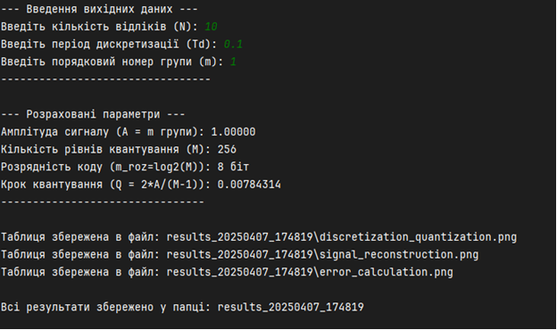
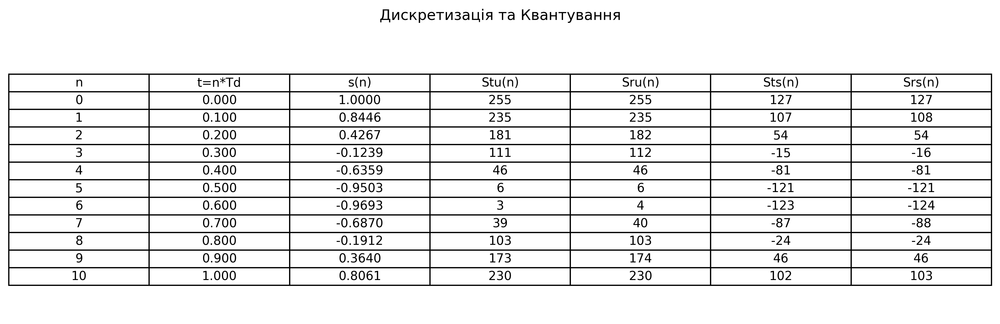
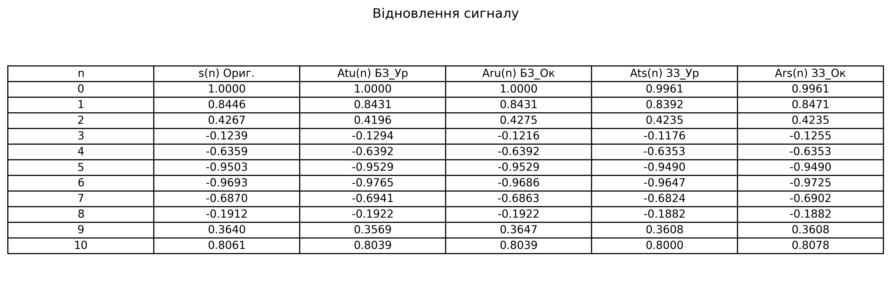
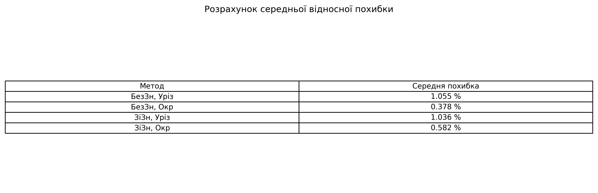

# Лабораторна робота: Квантування сигналу за рівнем

[](https://www.python.org/)
[](https://matplotlib.org/)

Проєкт демонструє процес квантування аналогового сигналу за рівнем і розрахунок середньої відносної похибки для різних методів квантування.

## Зміст
1. [Опис](#опис)
2. [Вимоги](#вимоги)
3. [Код програми](#код-програми)
4. [Результати](#результати)
5. [Висновки](#висновки)

## Опис

**Тема:** Квантування сигналу за рівнем  
**Мета:** вивчення процесу квантування аналогового сигналу за рівнем в цифрових системах.

## Вимоги
Квантувати аналогову функцію згідно з варіантом, де m = 1 (КІУКІ-24-1).

| Варіант     | Функція                       |
|-------------|-------------------------------|
| 17          | x(t) = – m cos (5.65t + π/ m) |

## Код програми

### Оголошення параметрів та функцій
```python
# Параметри квантування
M_levels = 256  # кількість рівнів квантування
num_bits = 8    # розрядність коду

# Аналоговий сигнал x(t) = -m * cos(5.65 * t + π / m)
def analog_signal(t: float, m: float) -> float:
    return -m * math.cos(5.65 * t + math.pi / m)

# Дискретизація сигналу
def discretize_signal(N: int, Td: float, m: float) -> List[float]:
    return [analog_signal(n * Td, m) for n in range(N + 1)]
```

### Квантування (урізання та округлення)
```python
# Обчислення значень квантування
for value in s_n:
    stu = int((value + amplitude) / Q_step)     # беззнакове урізання
    sru = round((value + amplitude) / Q_step)   # беззнакове округлення
    sts = int(value / Q_step)                   # знакове урізання
    srs = round(value / Q_step)                 # знакове округлення
```

### Відновлення сигналу після квантування
```python
# Відновлені значення
Atu_n = [stu * Q_step - amplitude for stu in Stu_n]  # БЗ урізання
Aru_n = [sru * Q_step - amplitude for sru in Sru_n]  # БЗ округлення
Ats_n = [sts * Q_step for sts in Sts_n]              # ЗЗ урізання
Ars_n = [srs * Q_step for srs in Srs_n]              # ЗЗ округлення
```

### Розрахунок похибки
```python
# Середня відносна похибка для кожного методу
error = abs((original - reconstructed) / original) * 100.0
```

## Результати

Всі результати автоматично зберігаються у вигляді PNG-файлів таблиць:
- **Дискретизація та Квантування** — `discretization_quantization.png`
- **Відновлення сигналу** — `signal_reconstruction.png`
- **Середня відносна похибка** — `error_calculation.png`

> Файли збережено у папці з міткою часу: `results_YYYYMMDD_HHMMSS`

<div style="display: flex; flex-direction: column; gap: 20px; margin-top: 20px;">
  <br>
  <em>Рисунок 1: Результати у консолі</em>
  <br><br><br>
  <br>
  <em>Рисунок 2: Дискретизація та квантування</em>
  <br><br><br>
  <br>
  <em>Рисунок 3: Відновлення сигналу</em>
  <br><br><br>
  <br>
  <em>Рисунок 4: Розразхунок середньої відносної похибки</em>
</div>


## Висновки
Під час виконання лабораторної роботи було вивчено процес квантування аналогового сигналу за рівнем. Програма реалізує чотири методи квантування (беззнакове урізання/округлення та знакове урізання/округлення), а також обчислює середню відносну похибку для кожного з них. Отримано графічні та числові результати, які дозволяють порівняти точність різних методів.
